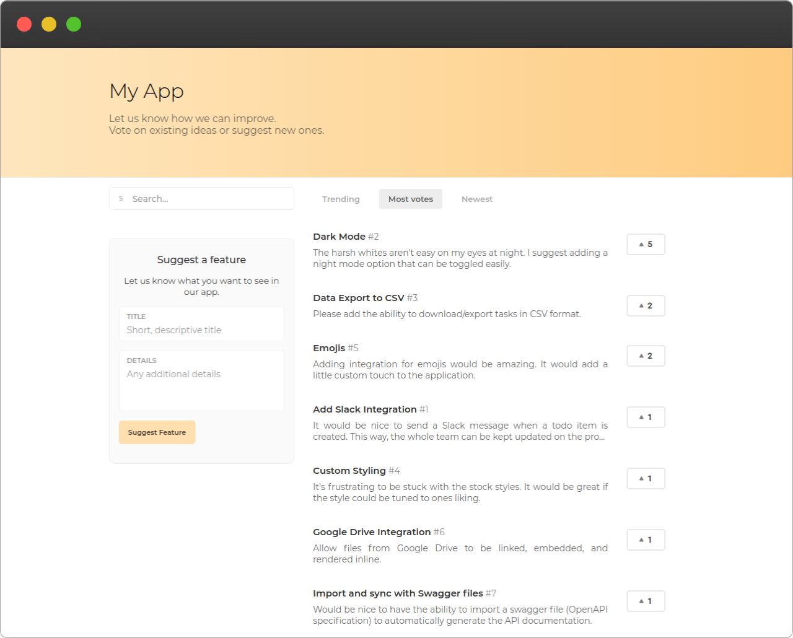

# Fyture :sparkles:
> A free open source feature request platform.

A minimalist application to allow your users to request, discuss and vote on new features or ideas for your product.



## Getting Started :rocket:

A dockerfile will be made to easily deploy this onto your own server -- still a work in progress.

## Development :gear:

```
yarn run dev
```

This will start the GoLang Gin server to server the app content and host the API. By default this runs on `localhost:8080`.

---

Pablo Gamito – [pablo.gamito.me](https://pablogamito.com) – pablo@gamito.me

Distributed under the GNU General Public License v3.0. See ``LICENSE.md`` for more information.

[https://github.com/PabiGamito/fyture](https://github.com/PabiGamito/fyture)